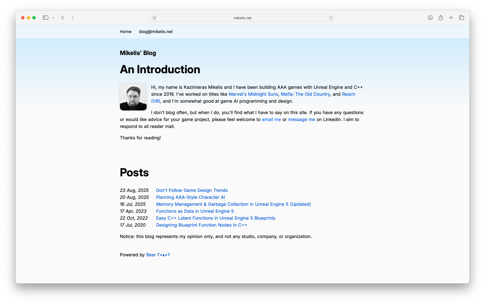
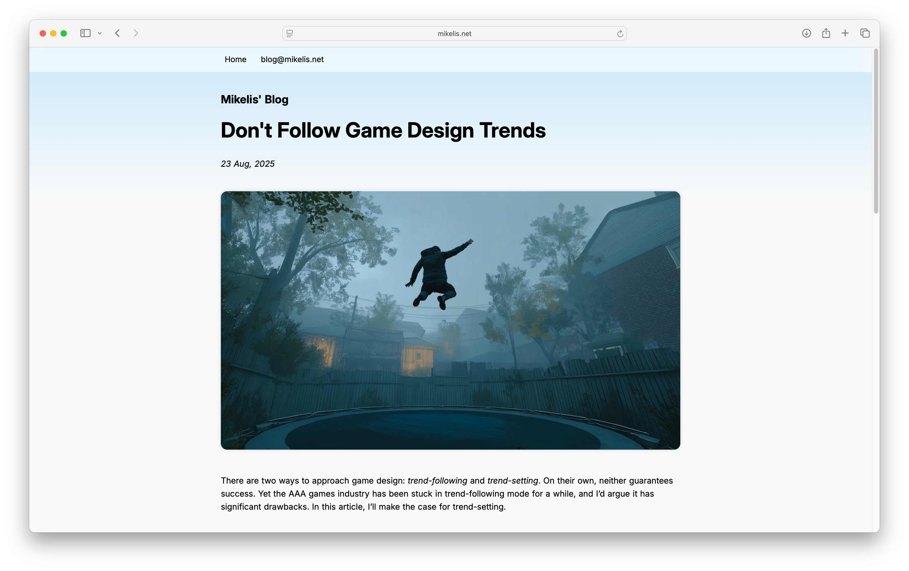
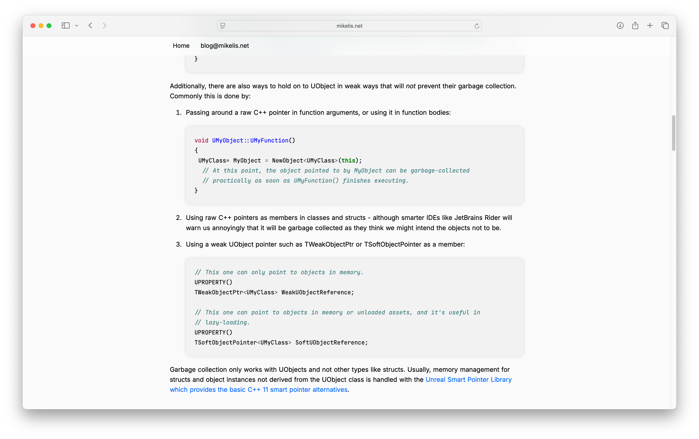
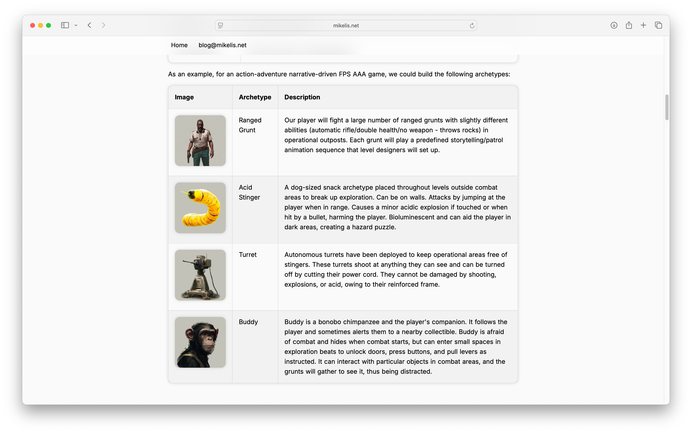
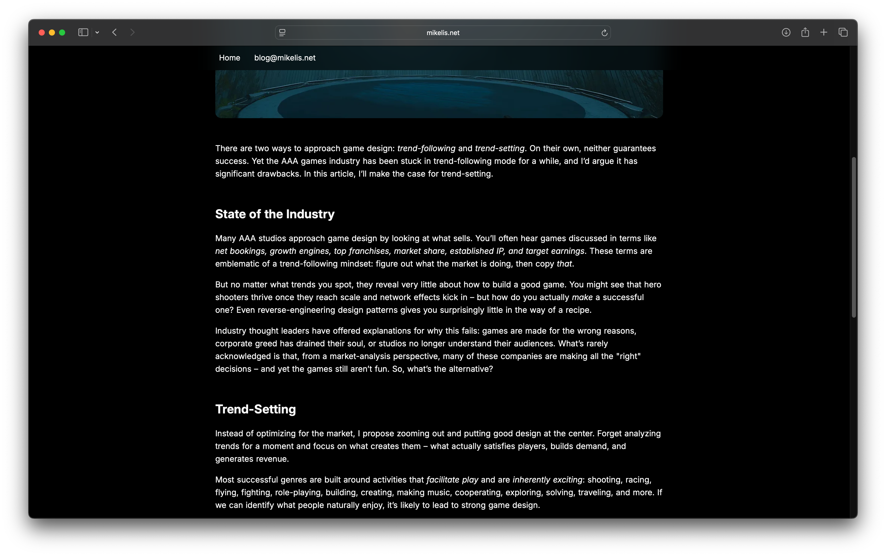
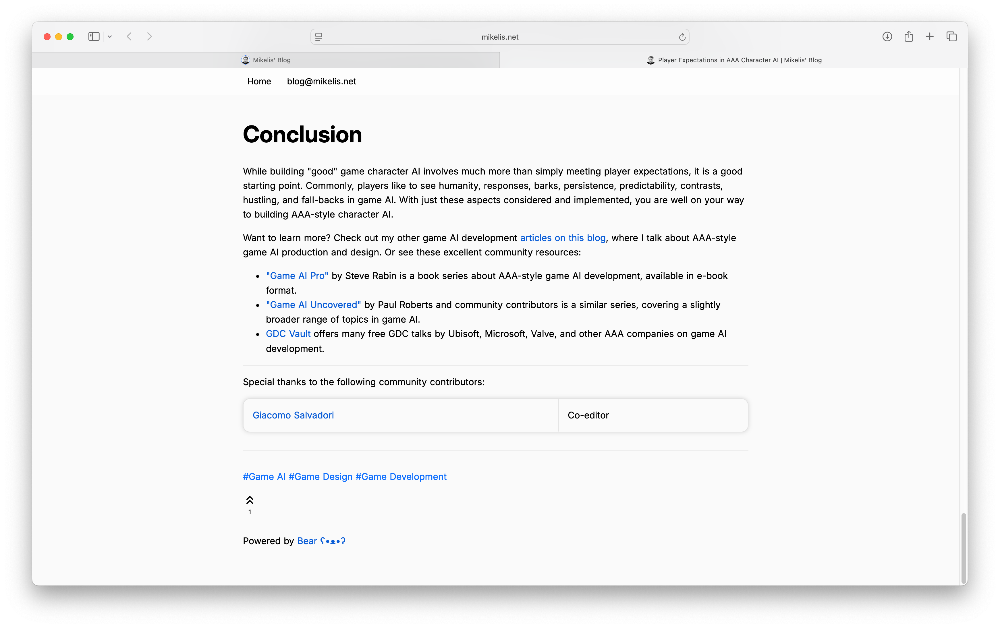

# Bearblog Soft-Stream Theme
A theme for [Bearblog](https://bearblog.dev), taking inspiration from GenX Soft Club, Frutiger Aero, Windows Vista, and OS X Snow Leopard.

It celebrates the golden age of the internet with:
- Exceptional readability with great contrast while avoiding bright extremes
- Clear typography
- Consistent visual hierarchy
- Consistent reuse of basic elements across images, tables, iframes, and elsewhere
- Hackable, tidy CSS

## Features
- Single responsive design
- Dark mode
- Beautiful highlighted code with JetBrains Mono
- Enhanced printing layout for blog posts
- Satisfying buttons: `[==Label==](link)`
- Custom image sizes: use `` with classes small-image and tiny-image
- Profile picture with rounded corners: use `` with class profilepic

## Screenshots

## Installation
Open [theme.css](https://raw.githubusercontent.com/kazimieras-mi/bearblog-softstream-theme/refs/heads/main/theme.css) and copy the contents into the "Edit theme CSS" box in Bearblog themes page.

Remember to back up your existing theme.

## Tweaks
The CSS uses variables, so changing colors, fonts, and the style of attention boxes is very easy. 

Adding a `**bold**` bit of text at the start of the nav bar looks quite good as a nav bar logo. The theme will space it correctly.

Give it a go and have fun.